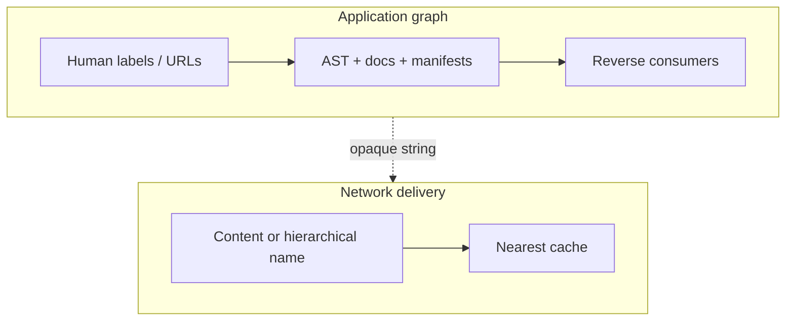
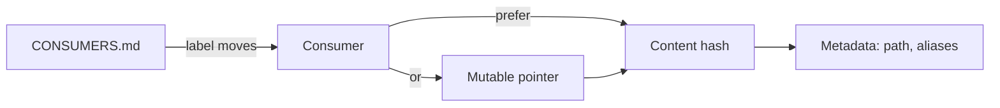

Pretty names are for people. Systems that treat those names as identity break when a rename ripples through dependents. This essay is the **diagnosis**: **labels versus wires**.

The web taught us a bad habit: treat the human-readable path as the thing itself.
Rename the path, and every dependent that baked the string becomes a broken promise.

This essay is the **diagnosis** face — paired with the symptom entry [When renaming a page breaks half your docs](/blog/when-renaming-a-page-breaks-half-your-docs/).
Full diagrams and the **treatment** ladder live in the docs: [Labels versus wires](https://hci-nerdz.github.io/docs/hci-nerdz/navigating-by-content.html).
Either face can revise without forcing a retitle of the other.

## Two naming problems, not one solution

**Named Data Networking (NDN)** and similar information-centric designs attack *location*: fetch by name without depending on a host IP.
Dr. Lan Wang's Networking Research Lab at the University of Memphis is one known node in that NSF-shaped research community.
NDN routers care whether an Interest can be satisfied from a nearby cache.
They do not rewrite your Markdown when `/docs/v1` becomes `/docs/v2`.
Those are different names.

**Application reverse-dependency tracking** attacks *semantic life cycle*: when a symbol, path, or doc label changes, who breaks?
Kythe/Sourcegraph graphs, OpenRewrite recipes, Unison's content-addressed definitions, and a humble producer-owned `CONSUMERS.md` all live here.

Architecturally orthogonal.
Complementary in UX: both serve “I should not have to care where it lives or what we currently call it,” if we stack them instead of collapsing them.

## The stack

1. **Content-addressed identity (CAS)** — bind to `hash(bytes)` (or a graph node id). Moves and renames with identical content do not break fetch: $Hash(Bytes_{old}) = Hash(Bytes_{new})$.
2. **Mutable human pointer** — a stable semantic name resolves to the *current* hash when content updates. Without this, CAS freezes you on $v1$ because $Hash(Bytes_{v1}) \neq Hash(Bytes_{v2})$.
3. **Reverse consumer graph** — producers list who still holds labels (`CONSUMERS.md`). Agents search those trees instead of guessing.
4. **Absorb layer** — redirects, Antora aliases, “cool URIs don’t change.” Required on today's IP web.

Unison shows the destination for *code* identity.
[connectome-fs](https://github.com/connectome-fs/connectome-fs) aims at the filesystem and association plane underneath many languages and non-code artifacts — path as projection, graph as truth.
See its explanation *Labels versus wires* beside *Semantic change units*.

## Near-term practice

Until CAS is ordinary:

- Prefer aliases over renames for anything public.
- Put reverse deps on the producer.
- Record coupling type (package vs URL vs Antora vs secret name).
- Teach tools and agents: read the list, search those trees, open PRs.
- Leave redirects forever.

Pretty URLs stay.
They just stop being the wire.
